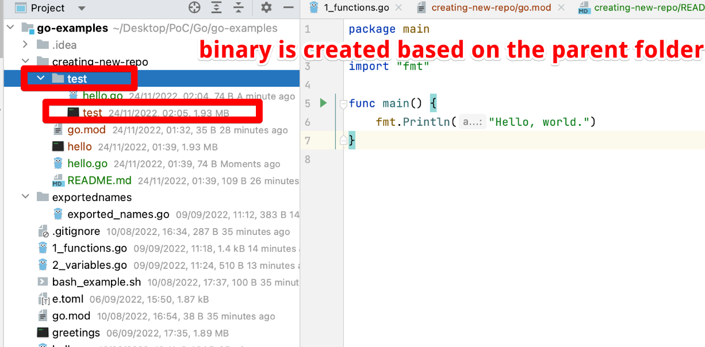

In orded to create new go repo or module
```bash
go mod init example/user/hello
```
`hello` - is the name of the package and binary!!! Since by convention, the package name is the same as the last element of the import path!
https://go.dev/doc/code

OR the right way - need to create the repo in Github and then :
```bash
go mod init github.com/USERNAME/REPO_NAME
```




